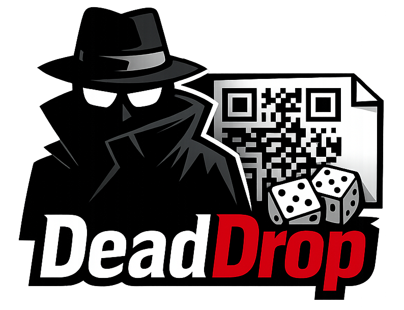

<p align="center">
  
</p>

<h1 align="center">Dead Drop</h1>

<p align="center">
  <em>Because some secrets are too important for a hard drive.</em>
</p>

<p align="center">
  <a href="https://github.com/jclement/deaddrop/actions/workflows/ci.yml"></a>
  <a href="https://github.com/jclement/deaddrop/releases/latest"></a>
  <a href="LICENSE"></a>
</p>

---

## The Problem

You have secrets that matter: GPG keys, cryptocurrency seed phrases, recovery codes, master passwords. You need to back them up somewhere that will survive a disaster.

Here's the thing about fire safes: they're great at protecting paper. They are *terrible* at protecting USB drives, SD cards, and hard drives. Digital media starts to fail at temperatures well below what a fire safe is rated for. Your carefully backed-up key file on a thumb drive might survive the fire as a small piece of melted plastic.

Paper, on the other hand, is remarkably resilient. But you can't just *print* a secret -- that puts the plaintext through your printer's memory, your print spooler, your network. And a printed secret sitting in a safe is one burglary away from compromise.

## The Solution

Dead Drop encrypts your secret and turns it into a printable PDF. The PDF contains a QR code and Z85-encoded text of the ciphertext -- not the secret itself. The decryption passphrase is displayed on screen for you to **handwrite** on the printed page. The key never touches the printer.

Toss it in a fire safe, a safe deposit box, or behind a loose brick in your favourite spy novel. When you need it back, scan the QR code and type in the passphrase.

## How It Works

```
ENCODE:  secret --> compress --> encrypt --> QR code + Z85 text --> PDF
DECODE:  scan QR (or type Z85) --> decrypt --> original secret
```

- **Encryption**: [age](https://age-encryption.org/) with scrypt passphrase
- **Passphrase**: Cryptographically strong [diceware](https://en.wikipedia.org/wiki/Diceware) (EFF wordlist, `crypto/rand`)
- **Compression**: zlib, to keep QR codes scannable
- **Fallback**: Z85 (ZeroMQ Base85) printed alongside the QR -- human-typeable if the code is ever unscannable

## Install

### Homebrew

```bash
brew install jclement/tap/deaddrop
```

### Go

```bash
go install github.com/jclement/deaddrop/cmd/deaddrop@latest
```

### Binary

Download from [Releases](https://github.com/jclement/deaddrop/releases/latest).

## Quick Start

### Encrypt a secret

```bash
# Back up a GPG key
gpg --export-secret-keys --armor my@email.com | deaddrop create -l "gpg-key" -

# Back up a file
deaddrop create seed-phrase.txt

# Type it in interactively
deaddrop create
```

Dead Drop generates a PDF and displays a passphrase:

```
Dead drop created.
  PDF:    deaddrop-20260320-120000.pdf
  Pages:  1

Write down this passphrase and destroy this terminal output:

╭───────────────────────────────────────────────╮
│  confess-task-little-headphone-sincere-runway  │
╰───────────────────────────────────────────────╯
```

Print the PDF. Handwrite the passphrase on it. Destroy the terminal output. Hide the page somewhere good.

### Restore a secret

When the day comes (and let's hope it doesn't):

```bash
# Scan the QR code from a photo
deaddrop restore photo-of-page.png

# Or paste the Z85 text interactively
deaddrop restore
```

Enter your handwritten passphrase when prompted. Your secret is back.

## Options

| Flag | Description |
|------|-------------|
| `-o, --output` | Output PDF path (default: `deaddrop-<timestamp>.pdf`) |
| `-l, --label` | Label for the PDF (appears as the page heading) |
| `-t, --title` | Centered title on the PDF page |
| `-w, --words` | Number of diceware words (default: 6, min: 5) |
| `--work-factor` | age scrypt work factor (default: 18) |
| `--no-instructions` | Omit restore instructions from PDF |
| `--json` | Output metadata as JSON |
| `--quiet` | Only output the passphrase |

## Restore Without Dead Drop

The PDF includes standalone instructions in case this tool disappears from the internet. You only need the [age](https://age-encryption.org/) CLI:

1. Scan the QR code or decode the Z85 text to get the binary payload
2. Save it to a file (e.g. `secret.age`)
3. Run `age -d secret.age`
4. Enter the handwritten passphrase

No proprietary formats. No lock-in. Just standard age encryption.

## Security

- The passphrase is **never printed or stored digitally** -- it exists on screen briefly, then only on paper in your handwriting
- Encryption uses age with scrypt (work factor 18), resistant to brute-force
- Passphrases are generated with `crypto/rand` via the EFF diceware wordlist
- Large secrets automatically split across multiple QR codes and PDF pages
- The `DD01` header identifies the payload format for future compatibility

## Development

Requires [mise](https://mise.jdx.dev/) for tool management.

```bash
mise run test        # Run tests with race detector
mise run lint        # Run linters
mise run build       # Build local binary
mise run build:all   # Build all targets (GoReleaser snapshot)
```

## License

[MIT](LICENSE)
